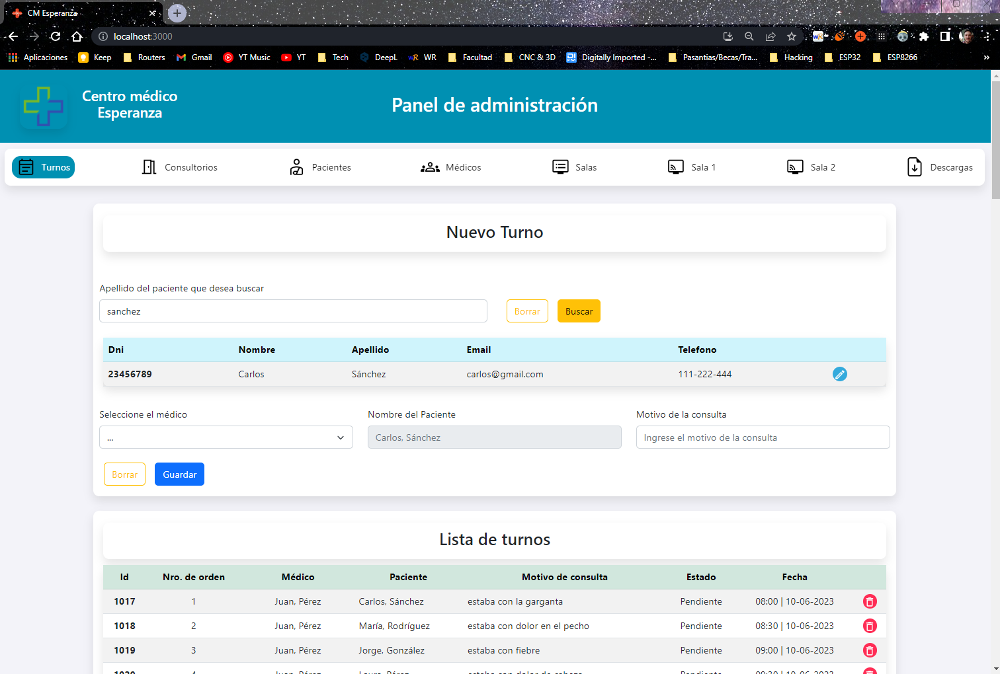
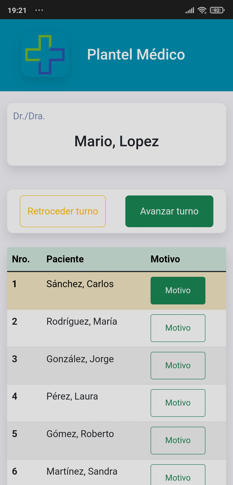
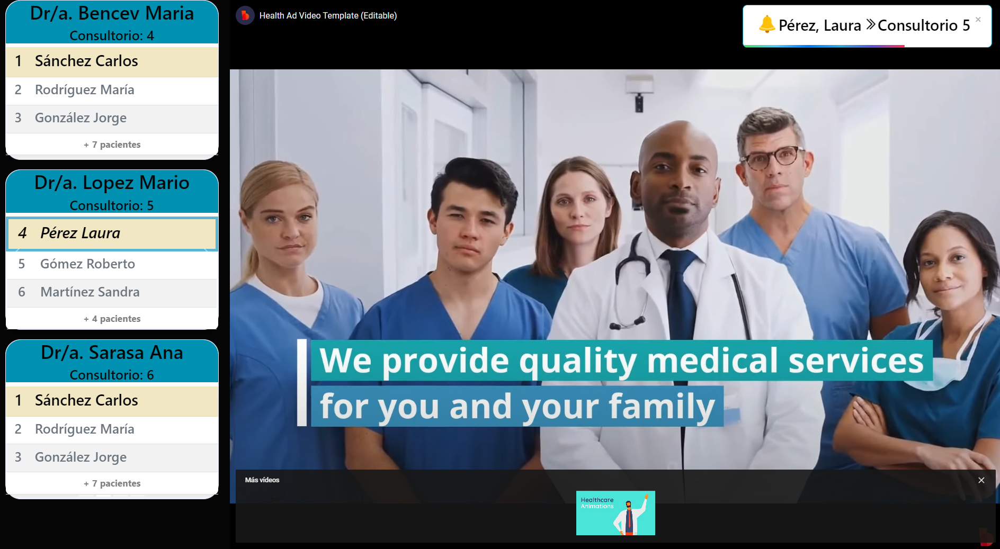

# Medical Center Appointment Scheduler (Frontend)

Medical Center Appointment Scheduler is a daily appointment management application designed for medical centers. This application enhances the patient experience in waiting rooms and lets the owner run ads while they wait.

## Description

This versatile application streamlines the management and display of appointments through three different views:

- **Receptionist View**: It allows receptionists to manage appointments, including operations for turns, offices, doctors, and patients.

  

- **Doctor View**: It provides doctors with an organized view of their patient list, reasons for visitation, and more importantly, they can call the next patient.

  
  <!--  -->

- **Patient View**: Displayed on TV screens distributed around the waiting room, patients can view the current status of all the offices. It notifies patients when a doctor triggers the call (upper-right corner).

  

## Pre-requisites

This frontend application requires the backend to function. Please ensure you have the backend up and running. You can find it [here](https://github.com/allanes/turnos-cm-backend).

## Installation

```bash
# Clone this repository
git clone https://github.com/allanes/turnos-cm-frontend.git

# Go into the repository
cd <your-repo>

# Install dependencies
npm install

# Run the app
npm start
