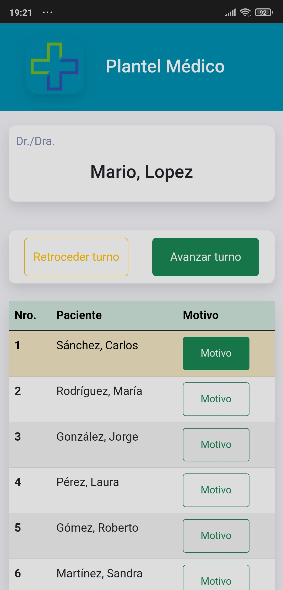

# Agenda de Turnos para Centros Médicos (Frontend)

La Agenda de Turnos para Centros Médicos es una aplicación gestión de turnos diseñada para centros médicos. Esta aplicación mejora la experiencia del paciente en las salas de espera y permite al propietario mostrar anuncios mientras esperan.

## Descripción

Esta aplicación versátil ayuda en la gestión y la visualización de turnos a través de tres vistas diferentes:

- **Vista de Recepcionista**: Permite a los recepcionistas gestionar los turnos, incluyendo operaciones para registrar consultorios, médicos y pacientes.

  

- **Vista de Médico**: Proporciona a los médicos una vista organizada de su lista de pacientes, razon de consulta, y llamado del siguiente paciente.

  
  <!--  -->

- **Vista de Paciente**: Mostrada en pantallas de TV agrupadas por sala de espera, los pacientes pueden ver el estado actual de todos los consultorios. Notifica a los pacientes cuando es su turno (esquina superior derecha).

  

## Pre-requisitos

Esta aplicación frontend requiere del backend para funcionar. Por favor, asegúrate de tener el backend en funcionamiento. Puedes encontrarlo [aquí](https://github.com/allanes/turnos-cm-backend).

## Instalación

```bash
# Clona este repositorio
git clone https://github.com/allanes/turnos-cm-frontend.git

# Ve al repositorio
cd <tu-repo>

# Instala las dependencias
npm install

# Ejecuta la aplicación
npm start
